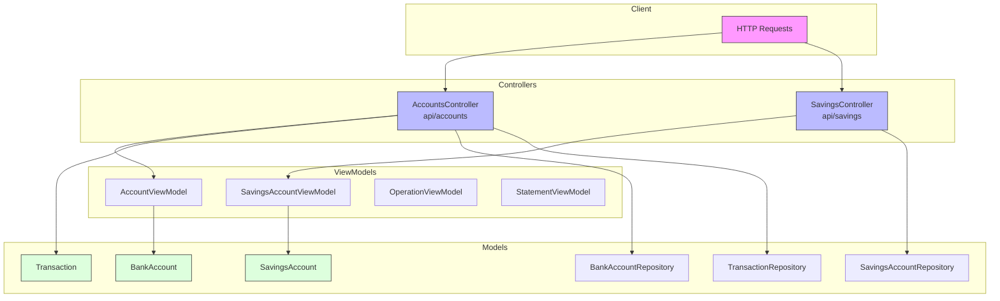

# Architecture MVC - BankingKata-MVC

### Flux de données

1. **Requête HTTP** → Controller
2. **Controller** → ViewModel (prépare la réponse)
3. **Controller** → Model/Repository (logique métier + données)
4. **Model** → Repository (persistance in-memory)
5. **ViewModel** → Réponse JSON