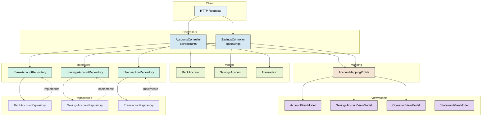
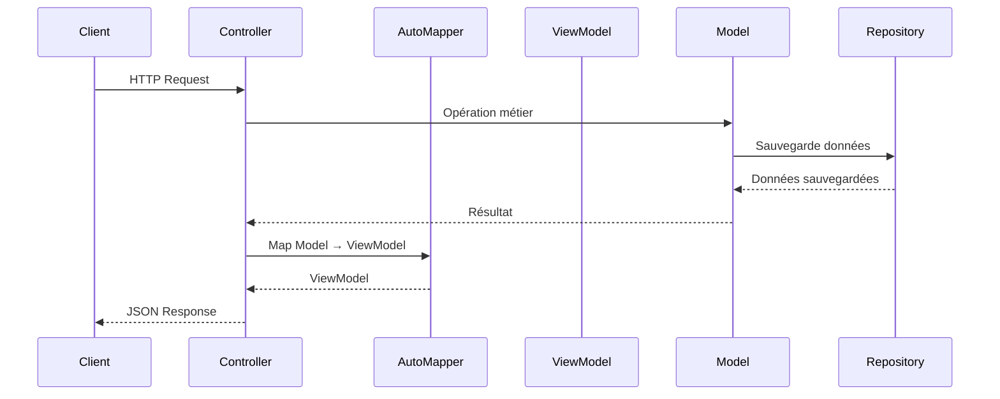

# BankingKata-MVC

API Bancaire en .NET 8 utilisant le pattern **MVC (Model-View-Controller)** avec **AutoMapper** et **Injection de Dépendances**.

## Architecture

```
BankingKata-MVC/
├── Models/                    # Modèles de domaine
│   ├── AccountModels.cs       # BankAccount, SavingsAccount, Transaction
│   ├── Repositories.cs         # Implémentations des repositories
│   └── Interfaces/            # Interfaces des repositories
│       ├── IBankAccountRepository.cs
│       ├── ISavingsAccountRepository.cs
│       └── ITransactionRepository.cs
├── ViewModels/               # Modèles pour les réponses API
│   └── AccountViewModels.cs
├── Controllers/              # Contrôleurs API
│   ├── AccountsController.cs
│   └── SavingsController.cs
├── Mapping/                  # Profils AutoMapper
│   └── AccountMappingProfile.cs
├── Tests/                    # Tests unitaires
│   └── BankingKata-MVC.Tests/
└── Program.cs                # Configuration DI + point d'entrée
```

## Pattern MVC

- **Model** : `Models/AccountModels.cs` - Logique métier (BankAccount, SavingsAccount, Transaction)
- **View** : ViewModels + réponses JSON de l'API
- **Controller** : `Controllers/AccountsController.cs`, `SavingsController.cs` - Gèrent les requêtes HTTP

## Injection de Dépendances (Program.cs)

```csharp
builder.Services.AddAutoMapper(cfg => cfg.AddProfile<AccountMappingProfile>(), typeof(AccountMappingProfile).Assembly);

builder.Services.AddScoped<IBankAccountRepository, BankAccountRepository>();
builder.Services.AddScoped<ISavingsAccountRepository, SavingsAccountRepository>();
builder.Services.AddScoped<ITransactionRepository, TransactionRepository>();
```

## Schéma de l'Architecture



## Flux de Données



## Endpoints

### Comptes Courants
| Méthode | Endpoint | Description |
|---------|----------|-------------|
| GET | `/api/accounts` | Liste tous les comptes |
| GET | `/api/accounts/{accountNumber}` | Détails d'un compte |
| POST | `/api/accounts` | Créer un compte |
| POST | `/api/accounts/{accountNumber}/deposit` | Déposer de l'argent |
| POST | `/api/accounts/{accountNumber}/withdraw` | Retirer de l'argent |
| POST | `/api/accounts/{accountNumber}/overdraft` | Modifier le découvert |
| GET | `/api/accounts/{accountNumber}/statement` | Relevé de compte |

### Livrets Épargne
| Méthode | Endpoint | Description |
|---------|----------|-------------|
| GET | `/api/savings` | Liste tous les livrets |
| GET | `/api/savings/{accountNumber}` | Détails d'un livret |
| POST | `/api/savings` | Créer un livret |
| POST | `/api/savings/{accountNumber}/deposit` | Déposer (plafond appliqué) |
| POST | `/api/savings/{accountNumber}/withdraw` | Retirer (fonds insuffisants si dépasse le solde) |

## Exemples de Requêtes

```bash
# Créer un compte
curl -X POST http://localhost:5000/api/accounts \
  -H "Content-Type: application/json" \
  -d '{"accountNumber": "ACC001", "initialBalance": 1000, "overdraftLimit": 500}'

# Déposer de l'argent
curl -X POST http://localhost:5000/api/accounts/ACC001/deposit \
  -H "Content-Type: application/json" \
  -d '{"amount": 500}'

# Obtenir le relevé
curl http://localhost:5000/api/accounts/ACC001/statement
```

## Lancer le Projet

```bash
cd BankingKata-MVC
dotnet run
```

L'API sera disponible sur `http://localhost:5000`
Swagger disponible sur `http://localhost:5000/swagger`

## Tests

```bash
cd BankingKata-MVC.Tests
dotnet test
```

Les tests couvrent :
- Logique métier des comptes (dépôt, retrait, découvert)
- Logique métier des livrets épargne (plafond de dépôt)
- Endpoints API (comptes et livrets)
- Mappage AutoMapper